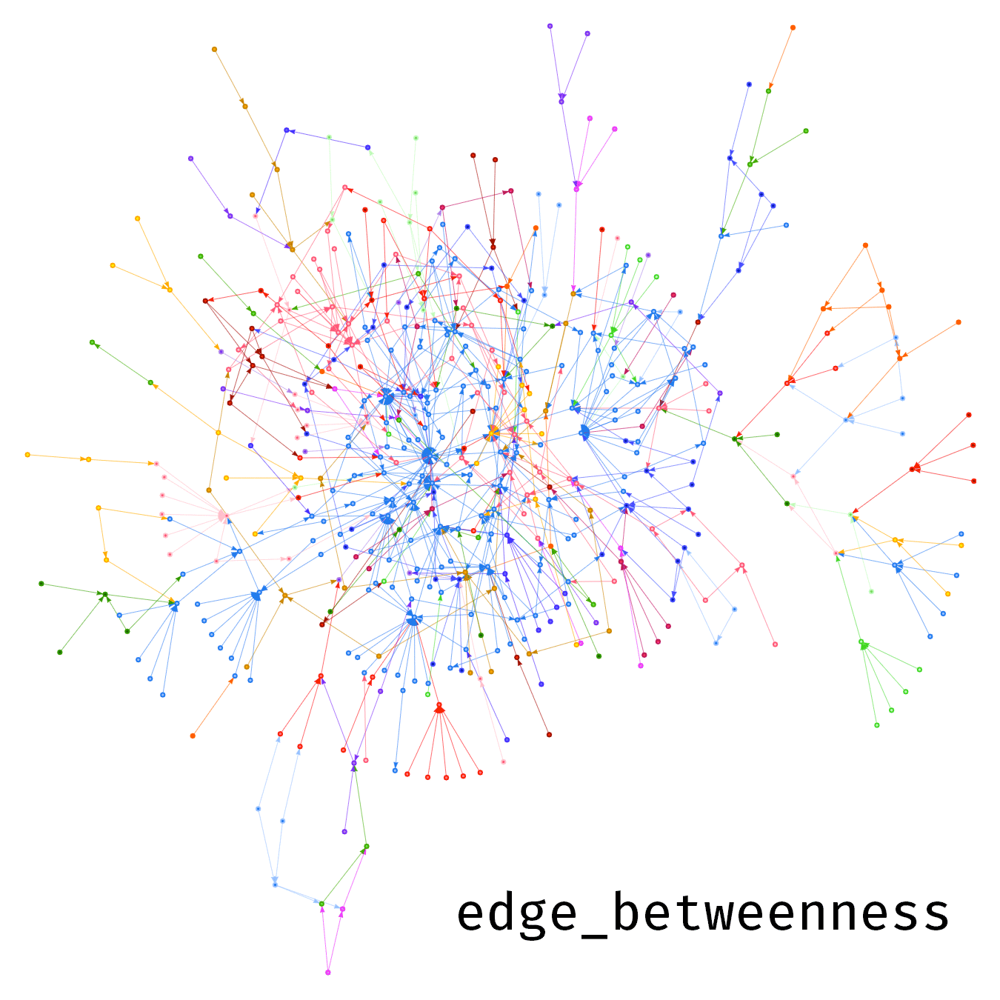
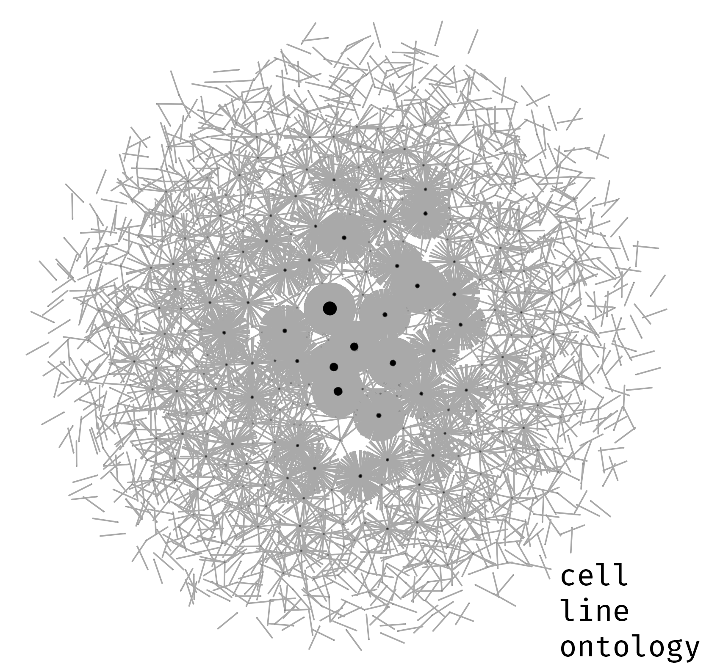
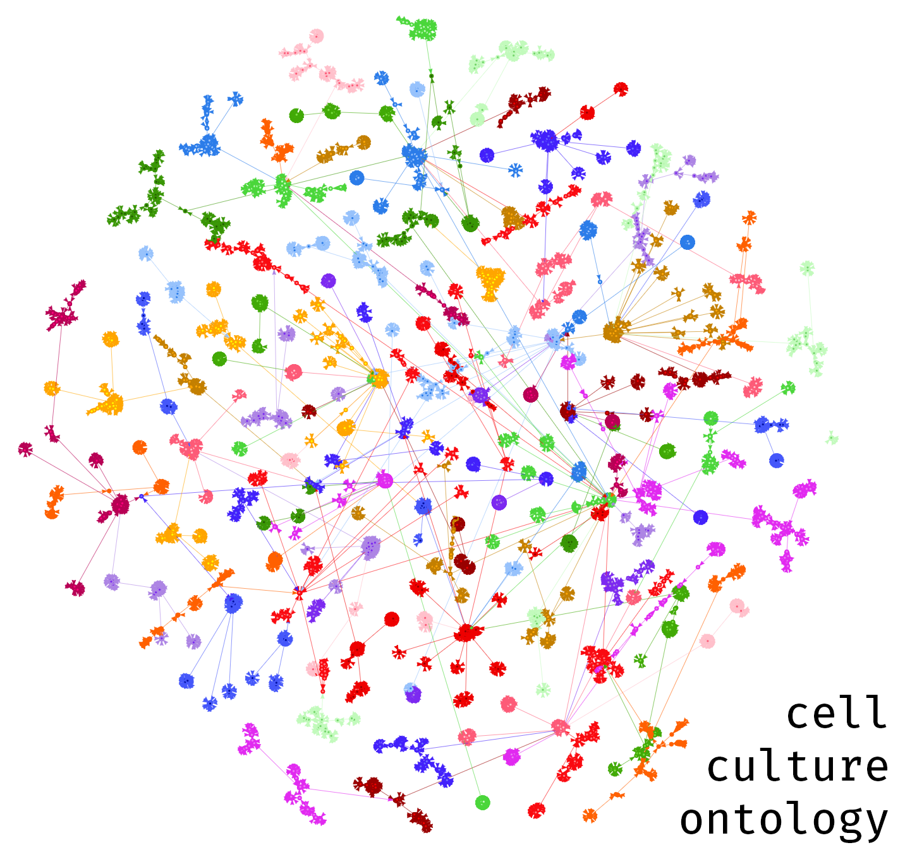
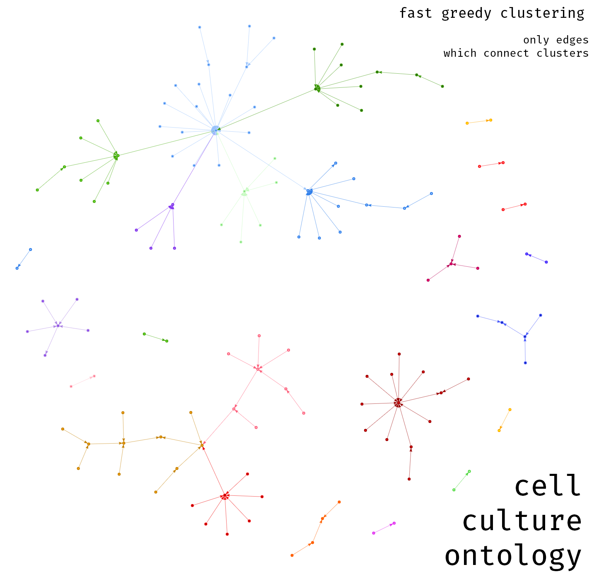
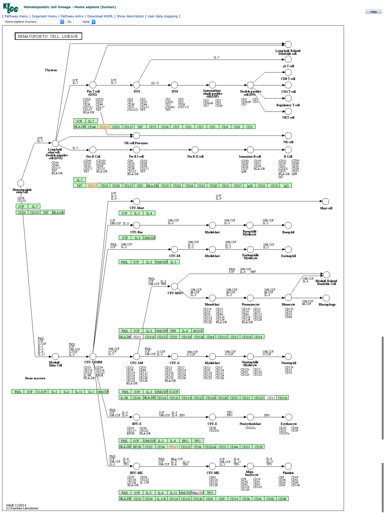
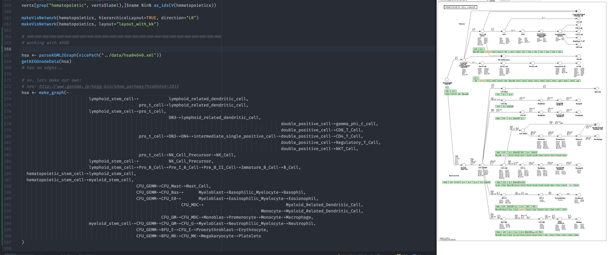
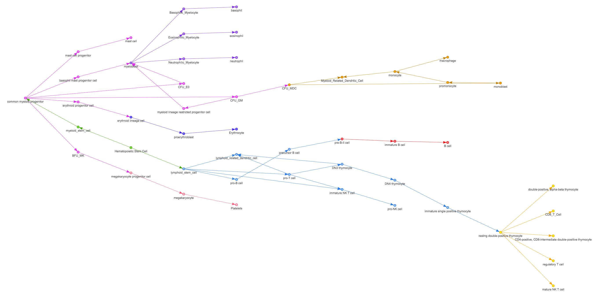
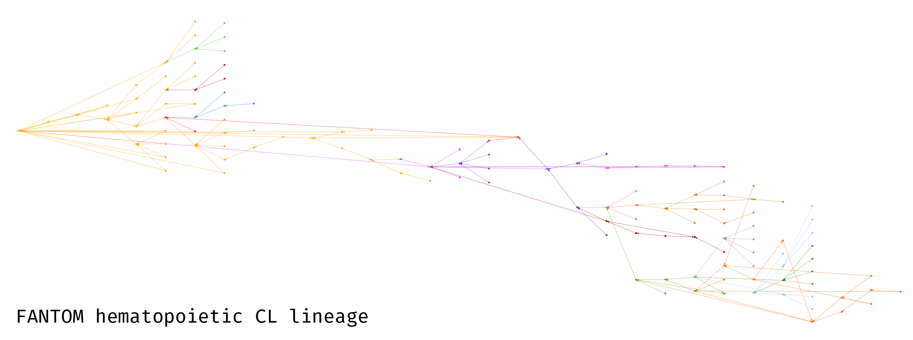
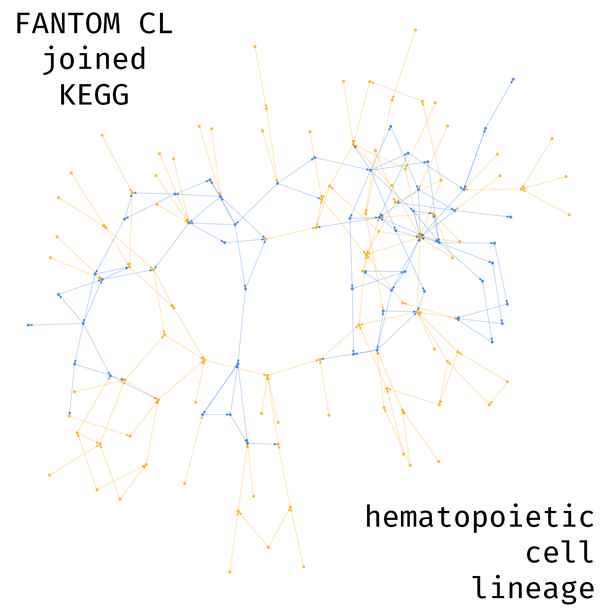

# ontoscope-cell-lineage
Cell Lineage Exploration Module for COdat for [Ontoscope](https://github.com/hyginn/Ontoscope).

## Purpose

Are [known lineages](https://www.google.ca/search?num=100&q=human+cell+lineage+tree)
represented in the expected way in COdat?

## Notebook

[As markdown](https://github.com/thejmazz/ontoscope-cell-lineage/blob/master/notebook.md)
(math equations not rendered) and [as pdf](https://github.com/thejmazz/ontoscope-cell-lineage/blob/master/notebook.pdf).

There are some extra images in the notebook that are not in the [Results](https://github.com/thejmazz/ontoscope-cell-lineage#results) 
section.

## Design and Plans

*Ontoscope cell lineage* is a module for investigating how well the FANTOM
Five ontology documents **human cell lineages**.

This investigation can manifest in a number of techniques:

- [ ] quantifying topological structure of graphs representing lineages; how well
  clusters represent separate lineages, if distance between cell types is
  consistent with expectations, etc
- [x] observe clusters on cell lineages
- [x] comparing fantom to other ontologies related to cell lineages; for example
  the cell line ontology and cell culture ontology
- [x] comparing fantom to lineage pathway data obtained from KEGG
- [x] normalizing vertex IDs between graph lineage representations
- [x] visually comparing separate graph lineage representations by joining them
- [ ] using graph alignment/similarity algorithms to compare separate graph
  representations of the same pathway

In this way, a fully implemented *cell-lineage-comparator* module would be
able to provide clues to the question:

**How similar is *this* lineage data to *that* lineage data?**

Results should be **quantifiable** as well as **visual**.

As well as providing the tools to generate *that* data, if required. For
example, there may not be an existing graph representation of a particular
lineage and so one can create this themselves.

## Results

### Cell Lineage Clusters

We can take all the `CL` terms from the FANTOM ontology and run a number of
clustering algorithms on the graph. Ideally this would separate known discrete
cell lineages. Some of the algorithms create many groups, whereas others
generate a manageable count. The graphs are visualized using `makeVisNetwork`
from `ontology-explorer.R` and can be viewed at the following links:

(note: check out [this bookmark](https://github.com/hyginn/Ontoscope/tree/master/phylify#visnetwork)
to make vis networks full screen)

All of the following plots are using the Kamada-Kawai layout.

- [fast_greedy](http://thejmazz.github.io/ontoscope-cell-lineage/CL_KK_fast-greedy.html)
- [edge_betweenness](http://thejmazz.github.io/ontoscope-cell-lineage/CL_KK_edge-betweenness.html)
- [infomap](http://thejmazz.github.io/ontoscope-cell-lineage/CL_KK_infomap.html)
- [louvain](http://thejmazz.github.io/ontoscope-cell-lineage/CL_KK_louvain.html)
- [walktrap](http://thejmazz.github.io/ontoscope-cell-lineage/CL_KK_walktrap.html)

The visualization of cluster groups through visNetwork has been completed and
has made its way into `ontology-explorer.R` for phylify.

### Quantifying Cell Lineage Graphs

[Ehud et. al (2012)](http://journals.plos.org/ploscompbiol/article?id=10.1371/journal.pcbi.1003297)
described a number of algorithms that reconstruct cell lineages and how they
fared against each other. The authors focused on examining two aspects of a
cell lineage:

1. clustering of biologically distinct groups
2. distinguishing between two groups of cells that are known to have different depths

A number of **distance measures** and **metrics for cluster quality** were used.
In brief, the distance measures were

- regular and normalized absolute genetic distance
- Euclidiean distance
- Equal or Not distance
- six versions of Maximum Likelihood using different mutation rates with stepwise and multistep mutation models

and the cluster metrics were

- Quality of the Largest Cluster (QLC)
- Tree Entropy (TE)
- Hyper geometric Sampling (HS)

See the [pdf notebook](https://github.com/thejmazz/ontoscope-cell-lineage/blob/master/notebook.pdf)
for the equations in detail.

In the case of the FANTOM ontology, which documents cell lineages through
the relations among `CL` terms, none of the above distance measures can be used
as there is no genetic information.

Cluster metrics could be used to quantify the performance of different
clustering algorithms. For example, quantitative values on the results of the
above visuals could be obtained. This has not been implemented at the  moment.

### Comparing to Other Ontologies

The [Cell Line Ontology](http://www.clo-ontology.org/) looked like an
interesting resource. However it did not resemble a nice hierarchical structure.
About 30000 nodes with 1000 or so parents just results in a group of
disconnected clumps. It seems as though this was made for annotating
properties of certain cell lines rather than the relations among the cell lines
themselves.

The [Cell Culture Ontology](https://bioportal.bioontology.org/ontologies/CCONT)
had a strong hierarchical structure, yet the largest cluster detailed the
relations among disorders, not cell line lineages.

Here is the [Cell Culture Ontology with fast greedy clustering](http://thejmazz.github.io/ontoscope-cell-lineage/CCONT_fast-greedy.html):

and here [with only edges connecting clusters](http://thejmazz.github.io/ontoscope-cell-lineage/CCONT_FG_connectors.html)
(alternative [hierarchical layout](http://thejmazz.github.io/ontoscope-cell-lineage/CCONT_FG_connectors_hierarchical.html)):

### KEGG

KEGG has one entry for a cell lineage - the
[Hematopoietic cell lineage - Homo sapiens (human)](http://www.genome.jp/kegg-bin/show_pathway?hsa04640+3815).

However, the KGML for this has 0 edges and is just the list of genes in the
green boxes. So, I reconstructed the lineage manually using a *literal formula*:

Then I normalized the vertex names between the KEGG and the FANTOM CL graph.
I `grep`ed for similar names in FANTOM and normalized where appropriate.
Not all terms were successfully normalized, and there could very well be
some mistakes. Take a look at the vertex renaming [here](https://github.com/thejmazz/ontoscope-cell-lineage/blob/master/scripts/fantom.R#L214).

At this point, we can have two graphs open:

[KEGG hematopoietic cell lineage, vertex names normalized](http://thejmazz.github.io/ontoscope-cell-lineage/KEGG_literal_normalized.html)

and the [FANTOM CL graph filtered to include 8 orders of in edges from "hematopoietic cell"](http://thejmazz.github.io/ontoscope-cell-lineage/FF_hematopoietic_hiearchical.html).
Past 8 orders, the vertex and edge count was the same.

Most of the structure between the KEGG and FANTOM CL graph is consistent.
We can also manually verify specific relations, like

- "lymphoid stem cell" *is_a* "hematopoietic stem cell"
- "myeloid stem cell" *is_a* "hematopoietic stem cell"

By this metric, **FANTOM effectively documents the hematopoietic cell lineage**.

### Visual Lineage Comparison

To create a unifying visual representation of the similarity between these
two hematopoietic cell lineage representations, I joined the graphs, and
grouped the nodes based on their origin. The blue nodes are all those from KEGG.

[hematopoietic cell lineage joined](http://thejmazz.github.io/ontoscope-cell-lineage/hema_joined_kk.html)

Since the network structure is largely retained, and the blue pieces seem to
"fit in", it can be further inferred that FANTOM documented the hematopoietic
cell lineage at an effective level.

However, this was a bit of an *ad hoc* attempt at graph alignment.

### Graph Alignment

I looked into the
[GraphAlignment](https://www.bioconductor.org/packages/release/bioc/html/GraphAlignment.html)
bioconductor package though it was a little complicated. The idea would be to
compare the normalized KEGG cell lineage graph to the FANTOM cell lineage graph.
This has not been implemented.
