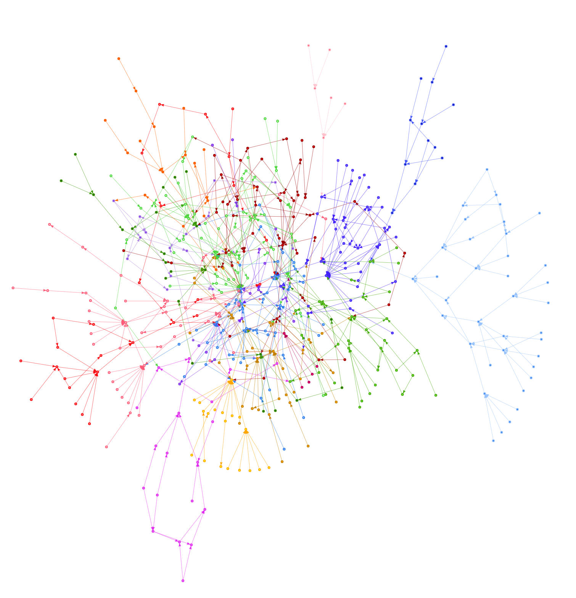
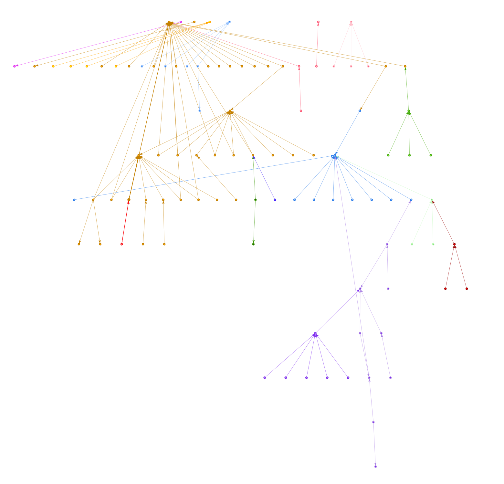
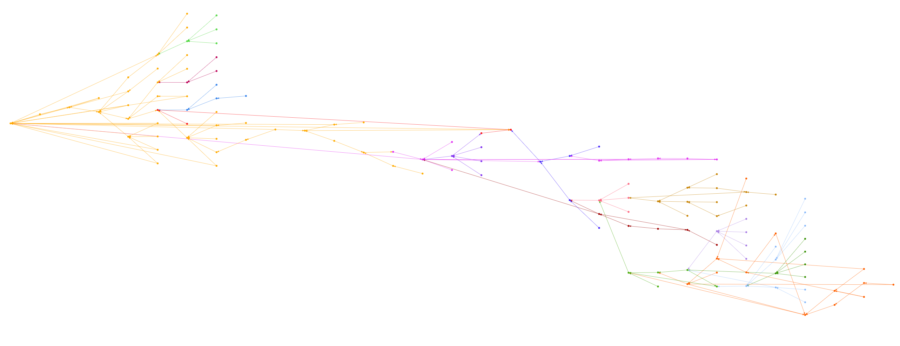
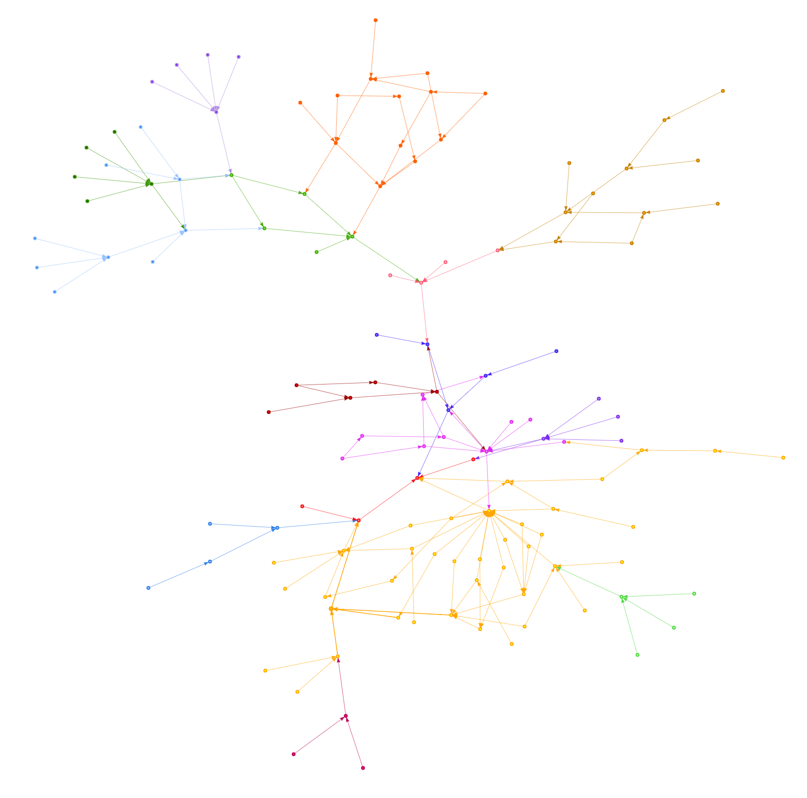
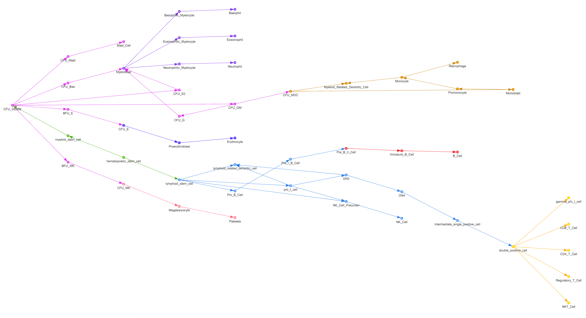
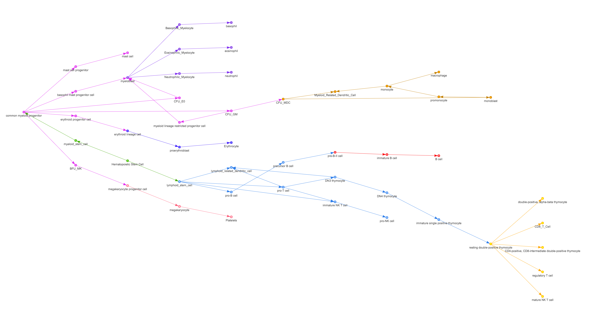

# Notebook

**2016/04/06**

- init repo, wiki page
- set an hour for investigating the questions
  - what are the primary human cell lineages?
  - where can we get data for them?
  - look into hematopoietic cell lineage
- some questions for the future
  - how many cell lineages represented in COdat?
  - how to separate cell lineages in COdat?
- there is [The Human Cell Lineage Flagship Initiative](http://www.lineage-flagship.eu/)
  - has not been updated since 2010
  - fertilized egg as root, extant cells as leaves, branches as cell divisions
  - cell lineage of *C. elegans* known
  - structure+dynamics of cell lineage in **development**, **growth**, **renewal**, **aging**, **disease**
  - diseases such as **cancer**, **auto-immune diseases**, **diabetes**, **neuro-degenerative**, **cardiovascular**, **rare inherited**
  - cells with similar **signatures** should reside close to each other in the cell lineage tree
  - if it is $1000 for whole genome sequencing, will be $100 000 000 000 000 000 for the entire cell lineage
  - but fraction of each genome is enough
  - [Presentation](http://www.lineage-flagship.eu/lineage/uploads/file/FlagshipLineage_v3.pdf)
  - [TEDxTelAviv - Ehud Shapiro - Uncovering the Human Cell lineage tree](https://www.youtube.com/watch?feature=player_embedded&v=Tm6Vqi38JGk)
  - [Reconstruction of Cell Lineage Trees in Mice](http://journals.plos.org/plosone/article?id=10.1371/journal.pone.0001939)
  - [more papers](http://www.lineage-flagship.eu/index.php?page_name=background)
  - [people](http://www.lineage-flagship.eu/index.php?page_name=people) - from UofT, [John Dick](https://oicr.on.ca/person/oicr-investigator/john-dick) working on 'Hematopoietic and immune system'
  - looked for more recent papers on cell lineages from Shapiro
    - [Comparing Algorithms That Reconstruct Cell Lineage Trees Utilizing Information on Microsatellite Mutations](http://journals.plos.org/ploscompbiol/article?id=10.1371/journal.pcbi.1003297)
- [Stem cell lineage database](https://en.wikipedia.org/wiki/Stem_cell_lineage_database)
- [Cell Lineage Analysis in Human Brain Using Endogenous Retroelements](http://www.sciencedirect.com/science/article/pii/S0896627314011374)
- [KEGG - Hematopoietic cell lineage](http://www.genome.jp/kegg-bin/show_pathway?hsa04640+3815)

TODOs for next session:
- look more into hematopoietic research, recent papers by John Dick?
- does KEGG have other cell lineages?
- which are the most studied human cell lineages?
- read Comparing Algs. That Reconstruct Cell Lineage Trees paper

**2016/04/07**

- [x] read Comparing Algs. That Reconstruct Cell Lineage Trees paper

**2016/04/08**

- [x] nothing

**2016/04/09**

### Comparing Algorithms That Reconstruct Cell Lineage Trees Utilizing Information on Microsatellite Mutations

- compared algs. and metrics on cluster and distance based methods
- vertices are cells, directed edges are progeny relationships
- examining only mutations in highly variable MS regions (also called STR)
- most algs. good if biological scenario to test for is *simple*
- best was neighbour joining with normalized abs. dist.
- idea: *distance* between genomic *signatures* can be used to reconstruct cell lineage tree
- slippage mutations @ $10^{-5}$ per locus per cell division vs. $10^{-10}$ for SNPs. also used mismatch-repair (MMR) deficient mice to get $10^{-2}$
- "best method is not the one that gives the most accurate estimates of the mean distance, but rather the one with the lowest variance"
- differences b/w cell lineage reconstruction and population genetics:
    * stem cells can influence shape of tree
    * sometimes very shallow tree
    * large variation in numbers of divisions the cells have undergone since the zygote (vs. species with different evolutionary paces)
    * cells have undergone binary cell divisions
- two aspects of the lineage were examined:
    * clustering of biologically distinct cell groups
    * distinguishing b/w two groups of cells that are known to have different *depths*
- tree reconstruction algorithms
    * **NJ** Neighbour Joining
    * **UPGMA** Unweighted Pair Group Method with Arithmetic Mean alg.
    * **QMC** Quartet Max Cut
- distance measures
    * $A_i^l$ and $A_j^l$ are the number of repeats in the $l$'th single allele of the $i$'th and $j$'th sampled cells
    * $\{ L \}$ is the set of $L$ alleles which were amplified for both samples $i$ and $j$
    * abs. genetic distance
        1. regular
           $$D(i,j) = \frac{1}{L} \sum_{l \in \{ L \}} | A_i^l - A_j^l |$$
        2. normalized
          $$D(i,j) = \frac{1}{L} \sum_{l \in \{L\}} \left | \frac{A_i^l}{\sum_{l \in \{L\}} | A_i^l |} - \frac{A_j^l}{\sum_{l \in \{L\}} | A_j^l} \right | $$
    * Euclidiean distance
      $$ D(i,j) = \sqrt{\sum_{l \in \{L\}} (A_i^l - A_j^l)^2} $$
    * Equal or Not distance
      $$ D(i,j) = \frac{1}{L} \sum_{l \in \{L\}} 1 \{ (A_i^l - A_j^l) \neq 0\} $$
    * six versions of **ML** Maximum Likelihood distances (ML estimate of the number of divisions separating the two cells):
      1. assuming equal mutation rates for all loci
      2. assuming two-different mutation rates for mono-nucleotide (1/22) and di-nucleotide (1/32) repeats
      3. assuming length dependent mutation rates
      4. three models with **SMM** Stepwise Mutation Model (equal prob. of addition/deletion of one repeat given that a mutation happens) and **MMM** Multistep Mutation Model (multiple additions/deletions of repeat unit possible according to a symmetrical dist.)
- clustered cells of individuals separately, but distinct clustering unlikely in some cases, esp. if individuals related
- three metrics to quantify clustering quality of distinct groups
    1. **QLC** Quality of the Largest Cluster

~~~~~
for each cell type i
  for each internal node
    count number of leaves of the i'th type that are descendants of this node
~~~~~

 - degree of node is defined as $p \cdot q$ where
    * $p$ is the percentage of cells from the $i$'th type that are descendants of this node out of all cells of type $i$
    * $q$ is the percentage of cells from type $i$ that are descendants of this node among all the cells that are descendants of this node
    * $q < 0.6 \Rightarrow$ degree is 0
    * score of each cell type $i$
  $$QLC_i = \max(p \cdot q)$$
    * and QLC of whole tree is avg. of QLC on all cell types
  $$QLC = \frac{1}{I} \sum_{i \in \{I\}} QLC_i $$

    2. **TE** Tree Entropy
        * assesses the amount of mixing on the tree b/w each pair of cell groups
        * affected only by number of clusters, not size
        * number of clusters of cell types $i$ and $j$ is obtained
        * equivalent state of the system is all the cases that will have the same number of clusters of each type. number of states:
$$ \Omega(i, j) = \frac{(n_i - 1)!}{(n_i - c_i)!(c_i - 1)!} c_i ! \frac{(n_j - 1)!}{(n_j - c_i)!(c_j - 1)!} c_j !$$
  where $n_i$ and $n_j$ are the number of cells of type $i$ and $j$, and $c_i$ and $c_j$ are the number of clusters of type $i$ and $j$
$$ \textrm{Entropy}(i,j) = \ln(\Omega) $$
    * entropy of tree is a half diagonal matrix (not scalar), scalar entropy is avg. over all pairs $i,j$:
$$ \textrm{Entropy} = \frac{1}{p} \sum_i \sum_{j = i+1} \textrm{Entropy}(i,j) $$
  where $P$ is the number of all pairs $i,j$

    3. **HS** Hyper geometric Sampling
        * test null hypothesis (no association b/w sub-tree and classification tree) with a hypergeometric test
        * given sub-tree of $n$ cells in which $x$ cells are of type $A$, the branch's p-value is the probability to see $x$ or more cells of type $A$ given that the $n$ cells are random samples from $N$:
        $$ p = f(n, N, s, x) = \frac{\left ( \begin{array}{l}
                                            s \\
                                            n
                                        \end{array} \right )
                                \left ( \begin{array}{l}
                                    N - s \\
                                    x -s \\
                                \end{array} \right )}{\left ( \begin{array}{l}
                                  N \\
                                  x
                                \end{array} \right )} $$
        * with 20% FDR. score for whole tree is
    $$HS = \frac{1}{I} \sum_{i \in \{I\}} HS_i $$

- issue: only a limited amount of MS available
- NJ-Normalized absolute was best at inferring clustering of distinct groups: demonstrates clear-cluster separation not necessarily correlated with precise description of mutational process
- depth measures
    * Kolmogorov Smirnov **KS** test
    * **ND** Normalized Distance
      $$ ND = \frac{|\mu_1 - \mu_2|}{\frac{\sigma_1 + \sigma_2}{2}} $$
    * overlap percentage
      $$ \textrm{Overlap} = \frac{\sum_{i=1}^{n_X} \sum_{j=1}^{n_Y} 1 \cdot \{\textrm{Dist}_Y(j) < \textrm{Dist}_X(i)\}}{n_X \cdot n_Y} $$

### Notes

- [StemDB](https://www.stemdb.org/StemDbWeb/celllines) has no cellines info..and signup 500s..
- [StemBase](http://www.stembase.ca/?path=/search/advanced) has a [cell lines list](https://github.com/thejmazz/ontoscope-cell-lineage/blob/master/cell-lines.md)
- [NCI60 List](https://dtp.cancer.gov/discovery_development/nci-60/cell_list.htm) (cancer cell line)
- [Sigma-Alrich Top 100 Cell Lines](https://www.sigmaaldrich.com/europe/life-science-offers/cell-cycle/sigma-ecacc-cell/top-100.html)
- [Cell line ontology](http://www.clo-ontology.org/)
- got [CSV](http://data.bioontology.org/ontologies/CLO/download?apikey=8b5b7825-538d-40e0-9e9e-5ab9274a9aeb&download_format=csv) from [BioPortal: Cell Line Ontology](http://bioportal.bioontology.org/ontologies/CLO)

**2016/04/10**

- made graph from CLO, using `Preferred.Label` and `Parents` columns
    * there are a TON of columns (554). and many are not filled for each row.
    * [cell-line-ontology.R](https://github.com/thejmazz/ontoscope-cell-lineage/blob/master/scripts/cell-line-ontology.R)
    * 39668 Nodes (38600 unique), only 1070 parents, 38620 edges
    * so: no nice tree. mostly just some clumps. Parents seem to be generic terms
    * [plot](https://github.com/thejmazz/ontoscope-cell-lineage/blob/master/plots/cell-line-ontology.png)
- there is the [CCONT](https://bioportal.bioontology.org/ontologies/CCONT/?p=summary)- [paper](http://journals.plos.org/plosone/article?id=10.1371/journal.pone.0048584)
    * [cell-culture-ontology.R](https://github.com/thejmazz/ontoscope-cell-lineage/blob/master/scripts/cell-culture-ontology.R)
    * [plot](https://github.com/thejmazz/ontoscope-cell-lineage/blob/master/plots/CellCultureOntology_01.png)
    * this data could be manageable and if all the little clusters were separated into nodes. trying out
    [cluster_edge_betweenness](http://igraph.org/r/doc/cluster_edge_betweenness.html) for this
    * [pretty gif](https://github.com/thejmazz/ontoscope-cell-lineage/blob/master/plots/CCONT.gif) (with **fast greedy** clustering)

**2016/04/11**

- took only those edges which connect clusters defined by **fast greedy**: [plot](https://github.com/thejmazz/ontoscope-cell-lineage/blob/master/plots/CellCultureOntology_02.png)
- produces three main trees:

  large
 
 medium
 
 small
 
 extras
 

The extras are too small to describe cell lines. Here are the plots with labels as descriptions:

rooted at EFO_0000787:

rooted at EFO_0000324:

rooted at EFO_0000508:

The last one is too big for a screenshot. [Browse network here](http://thejmazz.github.io/ontoscope-cell-lineage/CCONT_fast-greedy_desc.html). Make sure to use
the [fullscreen fix](https://github.com/hyginn/Ontoscope/tree/master/phylify#visnetwork).

This seems to essentially be a hierarchy of genetic disorders.

Not too useful as a cell lineage.

Thus not much to compare against FANTOM.

KEGG seems to only have hematopoietic cell lineage:

- [Re(de)fining the dendritic cell lineage](http://www.nature.com/ni/journal/v13/n12/abs/ni.2467.html)
- [Transcriptional regulation of the NKT cell lineage](http://www.sciencedirect.com/science/article/pii/S0952791513000046)

- [fast greedy fantom clustering](https://github.com/thejmazz/ontoscope-cell-lineage/blob/master/plots/fantom_cluster_01.gif)

#### comparing clustering algs. on all of fantom

**fantom_cluster_fast_greedy**

**fantom_cluster_infomap**

**fantom_cluster_leading_eigen**

**fantom_cluster_louvain**

**fantom_cluster_waltrap**

- from KEGG:

> Blood-cell development progresses from a hematopoietic stem cell (HSC), which can undergo either self-renewal or differentiation into a multilineage committed progenitor cell: a common lymphoid progenitor (CLP) or a common myeloid progenitor (CMP). A CLP gives rise to the lymphoid lineage of white blood cells or leukocytes-the natural killer (NK) cells and the T and B lymphocytes. A CMP gives rise to the myeloid lineage, which comprises the rest of the leukocytes, the erythrocytes (red blood cells), and the megakaryocytes that produce platelets important in blood clotting. Cells undergoing these differentiation process express a stage- and lineage-specific set of surface markers. Therefore cellular stages are identified by the specific expression patterns of these genes.

#### taking only CL IDs

**fantom_CL_layout_nicely**

**fantom_CL_kk_fast_greedy** (Kamada-Kawai layout)

**fantom_CL_fast_greedy** (only connective edges)

### taking only "hematopoietic cell" and 8 orders of in neighbours

after 8 orders, vertex/edge count is constant.

**hematopoietics_hiearchical**

**hematopoietics_kk**

**2016/04/12**

### using KEGG

- got KEGG data, it has 88 nodes but 0 edges
- transcribed KEGG pathway into igraph:

**kegg_hematopoietic_cell_lineage**

- manaually normalized node names

**kegg_hematopoietic_cell_lineage_normalized**

